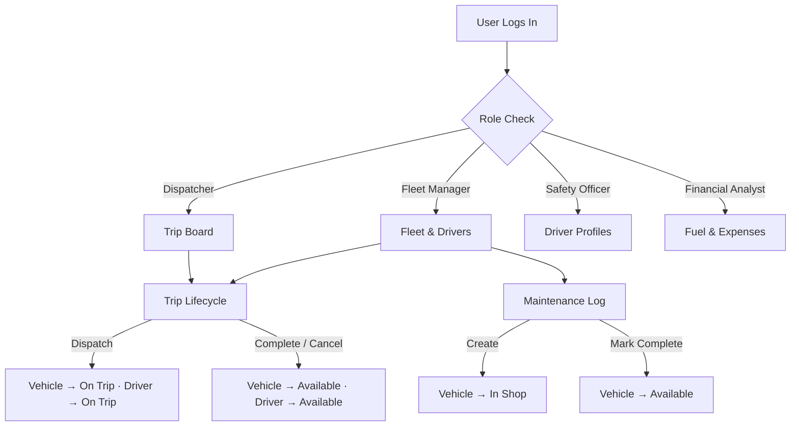

# 🚛 TransitOps

### *Smart Transport Operations Platform*

[](https://reactjs.org)
[](https://vitejs.dev)
[](https://tailwindcss.com)
[](https://supabase.com)

---

## 📖 Project Overview

**TransitOps** is a production-grade fleet management system built for transport depots. It gives operations teams a centralized hub to manage vehicles, drivers, trips, maintenance, and costs — with **role-based access control** enforced at both the route and action level.

Whether you're a Fleet Manager overseeing the full depot, a Dispatcher coordinating live trips, a Safety Officer auditing drivers, or a Financial Analyst tracking operational spend, TransitOps surfaces exactly what your role needs and nothing it doesn't.

---

## ✨ Core Features

- **🚗 Fleet Management**: Register vehicles with type, capacity, odometer, and acquisition cost. Track real-time status — Available, On Trip, In Shop, Retired — with automatic dispatch locking.

- **👤 Driver Management**: Maintain driver profiles with license details, category, and expiry. Safety score tracking with visual indicators. Suspended or expired-license drivers are automatically blocked from trip assignment.

- **📍 Trip Dispatch & Lifecycle**: Create and dispatch trips with source, destination, vehicle, driver, and cargo weight. Full lifecycle from Draft → Dispatched → Completed / Cancelled with a Live Board for real-time monitoring.

- **🔧 Maintenance Tracking**: Log service records per vehicle. Vehicle automatically moves to "In Shop" on log creation and returns to "Available" on completion.

- **⛽ Fuel & Expense Management**: Log fuel fills, toll, parking, and driver allowances. Status workflow from Pending Review → Processed / Rejected with live operational cost totals.

- **📊 Reports & Analytics**: Monthly revenue charts, fleet utilization %, fuel efficiency (km/L), ROI KPIs, top costliest vehicles, efficiency by fleet category, and per-vehicle drill-downs.

- **🔐 Role-Based Access Control**: Four built-in roles with route-level guards and action-level guards. Three guard modes — `hide`, `disable`, `tooltip`.

---

## 🏆 Role Permission Matrix

| Module | Fleet Manager | Dispatcher | Safety Officer | Financial Analyst |
|---|:---:|:---:|:---:|:---:|
| Fleet — view | ✅ | 👁 view | — | 👁 view |
| Fleet — add / edit | ✅ | — | — | — |
| Drivers — view | ✅ | — | ✅ | — |
| Drivers — add / edit | ✅ | — | ✅ | — |
| Trips — view | — | ✅ | 👁 view | — |
| Trips — dispatch / complete / cancel | — | ✅ | — | — |
| Fuel & Expenses | — | — | — | ✅ |
| Analytics & Reports | ✅ | — | — | ✅ |
| Settings | ✅ | — | — | — |

**Legend:** ✅ full access · 👁 view only · — no access

Default landing pages after login — Fleet Manager → `/vehicles`, Dispatcher → `/trips`, Safety Officer → `/drivers`, Financial Analyst → `/fuel-expenses`.

---

## 🔄 Workflow Diagram



---

## 🏗️ System Architecture

TransitOps is built on a reactive, single-page architecture with a serverless backend:

- **Frontend**: React SPA with global context state, role-aware routing, and component-level permission guards.
- **Backend / Database**: Supabase (PostgreSQL) with row-level security, DB triggers for automatic status propagation, and a fully normalized schema.
- **RBAC Layer**: Permission checks at both the route level (`RequirePermission` wrapper) and action level (`ProtectedAction` component + `usePermissions` hook).

---

## 🛠️ Tech Stack

**Frontend**
- React 19, React Router v7
- Tailwind CSS v3
- Vite 8
- Supabase JS client

**Backend / Database**
- Supabase (PostgreSQL)
- Row-level security via Supabase Auth
- DB triggers for automatic status propagation

---

## 📁 Project Structure

```
transitops/
├── frontend/
│   ├── src/
│   │   ├── components/common/
│   │   │   ├── Header.jsx
│   │   │   ├── Sidebar.jsx
│   │   │   └── ProtectedAction.jsx     # RBAC wrapper component
│   │   ├── context/
│   │   │   └── AppDataContext.jsx      # Global state + Supabase calls
│   │   ├── hooks/
│   │   │   └── usePermissions.js       # Permission check hook
│   │   ├── layouts/
│   │   │   └── AppLayout.jsx
│   │   ├── lib/
│   │   │   ├── permissions.js          # Role matrix + route guards
│   │   │   └── supabase.js
│   │   └── pages/
│   │       ├── Dashboard.jsx
│   │       ├── Vehicles.jsx / AddVehicle.jsx
│   │       ├── Drivers.jsx
│   │       ├── Trips.jsx
│   │       ├── Maintenance.jsx
│   │       ├── FuelExpenses.jsx
│   │       ├── Reports.jsx
│   │       ├── Settings.jsx
│   │       └── Support.jsx
│   └── package.json
├── backend/
│   ├── supabase_schema.sql             # Full DB schema + triggers
│   ├── seed.mjs                        # Sample data seeder
│   └── check_trips.mjs
└── README.md
```

---

## ⚙️ Installation & Setup

### Prerequisites
- Node.js 18+
- A [Supabase](https://supabase.com) project

### 1. Clone the Repo

```bash
git clone https://github.com/saloni-s11/TransitOps-Smart-Transport-Operations-Platform.git
cd TransitOps-Smart-Transport-Operations-Platform
```

### 2. Set Up the Database

Run `backend/supabase_schema.sql` in your Supabase SQL editor. This creates all tables, constraints, and triggers.

To seed sample data:

```bash
cd backend
node seed.mjs
```

### 3. Configure Environment Variables

Create `frontend/.env.local`:

```env
VITE_SUPABASE_URL=https://your-project.supabase.co
VITE_SUPABASE_ANON_KEY=your-anon-key
```

### 4. Run the Frontend

```bash
cd frontend
npm install
npm run dev
```

The app will be available at `http://localhost:5173`.

---

## 💡 Usage Flow

1. **Login**: Select your role from the login screen. Demo mode is available — if Supabase isn't configured, the app falls back automatically so you can explore the UI without a live database.
2. **Manage Fleet**: Register vehicles, update statuses, and log maintenance records.
3. **Dispatch Trips**: Assign available vehicles and drivers, validate cargo weight, and monitor the Live Board.
4. **Track Costs**: Log fuel fills and expenses, review status workflows, and monitor live operational totals.
5. **Analyze**: Review monthly revenue, fleet utilization, fuel efficiency, and per-vehicle cost breakdowns in the Reports page.

---

## 🔐 RBAC Implementation

Permission checking is layered at two levels:

**Route level** (`App.jsx`) — Every protected route is wrapped in `<RequirePermission>`, which checks `canAccessRoute(role, path)` and silently redirects unauthorized users to their default landing page.

**Action level** (`ProtectedAction.jsx`) — Wrap any button or interactive element:

```jsx
<ProtectedAction permission={PERMISSIONS.ADD_VEHICLE} mode="hide">
  <button>Add Vehicle</button>
</ProtectedAction>

<ProtectedAction permission={PERMISSIONS.DISPATCH_TRIP} mode="tooltip">
  <button>Dispatch</button>
</ProtectedAction>
```

Modes:
- `hide` — element is removed from the DOM entirely
- `disable` — element is visible but greyed out and non-interactive
- `tooltip` — element is visible with a lock icon explaining the restriction

Check permissions in component logic with the `usePermissions` hook:

```js
const { can, canAny, role, isFleetManager } = usePermissions();

if (can(PERMISSIONS.EDIT_VEHICLE)) { /* ... */ }
```

---

## 🗄️ Database Schema

```
vehicles            → fleet registry
drivers             → personnel + license + safety score
trips               → source/destination/vehicle/driver/cargo
maintenance_logs    → service records per vehicle
fuel_logs           → fuel fills linked to vehicle + optional trip
expenses            → toll, parking, misc per vehicle + optional trip
user_profiles       → linked to Supabase Auth users
```

**Key DB triggers:**
- `trigger_update_trip_status` — dispatching, completing, or cancelling a trip automatically flips vehicle and driver status.
- `trigger_handle_maintenance_status` — creating or completing a maintenance log flips the vehicle to In Shop / Available.

---

## 📜 Available Scripts

```bash
# Frontend
npm run dev        # Start dev server
npm run build      # Production build
npm run preview    # Preview production build
npm run lint       # Run oxlint

# Backend
node seed.mjs      # Seed the database with sample data
```

---

## 🔮 Future Enhancements

- [ ] **Live GPS Tracking**: Real-time vehicle location overlaid on a map dashboard.
- [ ] **Driver Mobile App**: React Native companion app for drivers to update trip status on the go.
- [ ] **Push Notifications**: Alerts for maintenance due dates, license expirations, and trip delays.
- [ ] **Multi-Depot Support**: Manage multiple depots under a single organization account.
